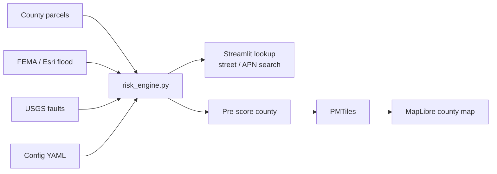

# Northern Nevada Parcel Risk Pipeline

Portfolio project that scores northern Nevada parcels for **flood** and **fault**
exposure, then shows the results in two places:

- a **lookup app** (search a street or parcel number)
- a **county map** (pan and zoom across pre-scored parcels)

Data comes from public web GIS services (county parcels, FEMA flood layers, USGS
faults). Scoring rules are in a config file so they can be changed without
rewriting the app.

**Counties with maps ready to build:** Washoe, Storey, Lyon, Carson City,
Douglas, Churchill, Humboldt, Elko.

---

## Walkthrough

[**Watch the project walkthrough (~1 min)**](https://katyaalimov.github.io/northern-nv-parcel-risk/walkthrough.html)

---

## What it does

1. Downloads parcels, flood zones, and fault lines  
2. Checks whether a parcel sits in a flood zone and how far it is from the nearest fault  
3. Labels each parcel **High**, **Moderate**, or **Low**  
4. Puts that answer in the lookup app and (after a map build) on a county map  

---

## Architecture



---

## How to run the lookup app

```bash
git clone https://github.com/KatyaAlimov/northern-nv-parcel-risk.git
cd northern-nv-parcel-risk
python3 -m pip install -r requirements.txt
python3 -m streamlit run app.py
```

Open **http://localhost:8501**, pick a county, search by area / street / parcel
number (APN), then click **Analyze risk**.

---

## County map

The full-county map files are large, so they are not stored in GitHub. To build
and view Washoe’s map:

```bash
# Needs tippecanoe (map tile tool). On macOS: brew install tippecanoe
python3 04_build_reno_tiles.py --region washoe
python3 05_serve_city_map.py
```

Open **http://localhost:8080/city_map.html**.

Use another county name with `--region` (for example `storey`, `lyon`, `elko`).

**Or** run both the app and map with Docker (after tiles exist):

```bash
docker compose up --build
```

---

## How risk is scored

- **Flood:** parcels in a FEMA flood hazard area score higher  
- **Fault:** parcels closer to a USGS fault score higher  
- **Combined:** weighted mix of those two (about 60% flood / 40% fault by default)  
- **Label:** High / Moderate / Low from the combined score  

Map locations use normal GPS coordinates; fault distance is calculated in meters.

---

## Project layout

| File / folder | What it’s for |
|---|---|
| `app.py` | Lookup app |
| `risk_engine.py` | Downloads GIS data and scores parcels |
| `config/` | County list and scoring settings |
| `04_build_reno_tiles.py` | Builds the county map files |
| `05_serve_city_map.py` | Serves the county map locally |
| `templates/city_map.html` | County map web page |
| `docker-compose.yml` | Runs the app + map together |
| `docs/` | Walkthrough video and page |

---

## Data sources

- County parcel layers (ArcGIS REST)  
- FEMA / Esri flood hazard  
- USGS Quaternary faults  

No API keys are required for these public services.
